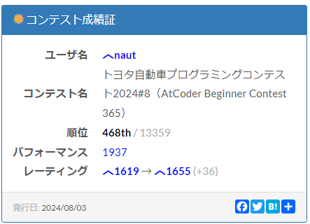

## AtCoder Beginner Contest 365

[コンテストページ](https://atcoder.jp/contests/abc365)

* 23分40秒で5完して、468位でした。

### A問題

* うるう年の条件が問題文で与えられるので、西暦 $Y$ 年の日数を求めてください。
* 問題文通りに実装すれば OKです。

### B問題

* 長さ $N$ の相異なる項からなる数列 $A$ が与えられます。$A$ の中で $2$番目に大きい要素は何番目の要素かを求めてください。
* 上手くやれば $O(N)$ でもできますが、$N \leq 100$ なので、$A$をソートした配列$B$の後ろから二番目の要素と一致するもののインデックスを出力すればよいです。

ここからは少し丁寧に振り返ります。

### C問題

#### 問題概要

* $N$ 人がイベントに参加し、それぞれ交通費が$A_i$円かかります。
* 交通費の補助額を上限$x$円と設定し、人$i$には$\min{(x, A_i)}$を支給します。
* 予算が$M$円なので、$N$人に渡す補助額の総和を$M$円以下にしたいです。
* $x$を最大で何円にできるかを求めてください。ただし、上限が存在しない場合、そのことを出力します。
* $N \leq 2 \times 10^{5}, M \leq 2 \times 10^{14}$

#### 考えたこと

まず、上限が無限に大きくできるときは、どのような条件が成り立つかを考えます。

$x \geq \max{A_i}$ を満たす$x$では、補助額の総和は同じです。したがって、$x = \max{A_i}$ のとき予算をオーバーしないなら、上限は存在しません。また、同様に上限が存在するなら必ず、$x < \max{A_i}$が成り立ちます。

上限が存在し、それを$m$であるとします。$[0, \max{A_i})$の範囲で二分探索を行えば、補助額の総和が$M$円以下の補助額の上限値の最大値は、$m$と一致します。したがって、$O(N \log{\max{A_i}})$ で答えが計算できます。

### D問題

#### 問題概要

* 2人のプレイヤーがじゃんけんをします。相手が出した手を事前に知っていて、それは$S = S_1 S_2 \dots S_N$で表されます。
* 私は、以下の条件を満たすように手を出す必要があります。それを満たすような手の列の内、じゃんけんで勝った回数の最大値を計算してください。
  * 私は一度もじゃんけんに負けない。
  * 私が$i$回目に出す手と$i + 1$回目に出す手は異なる。
* $N \leq 2 \times 10^{5}$

#### 考えたこと

1手目から順に出す手を決めていくとします。このとき、$i$手目を制限するのは、相手の手と自分が$i - 1$手目だけです。

そこで、$i$ 手目がグー、チョキ、パーそれぞれでの勝った回数の最大値が計算できれば$i + 1$手目でグー、チョキ、パーそれぞれでの勝った回数の最大値が計算できます。

これは適当な動的計画法で$O(N)$で可能です。[提出コード](https://atcoder.jp/contests/abc365/submissions/56260751)

### E問題

#### 問題概要

* 長さ$N$の数列$A = (A_1, A_2, \dots, A_N)$が与えられます。以下の値を計算してください。

$$
\sum_{i = 1}^{N - 1} \sum_{j = i + 1}^{N} {A_i \oplus A_{i + 1} \oplus \dots \oplus A_{j}}
$$

* $N \leq 2\times 10^{5}, 1 \leq A_i \leq 10^{8}$

#### 考えたこと

まず、各bit毎に考え、それらを後から合算して答えを計算することにします。

$i$ bit 目を取り出して $B_1, B_2, B_3, \dots, B_N (B_j = 0, 1)$とします。

$k$ 項目を右端とするような部分排他的論理和について考えます。きちんと列挙すると、$\oplus_{i=1}^{k} B_i, \oplus_{i=2}^{k} B_i, \dots, \oplus_{i=k-1}^{k} B_i$のように書けます。

同様に、$k + 1$ 項目を右端とするような部分排他的論理和について考えます。きちんと列挙すると、$\oplus_{i=1}^{k+1} B_i, \oplus_{i=2}^{k+1} B_i, \dots, \oplus_{i=k}^{k+1} B_i$のように書けます。

それぞれ $S_k, S_{k + 1}$ とします。$S_{k + 1} = \lbrace a \oplus B_{k+1} | a \in S_k \rbrace \cup \lbrace B_k \oplus B_{k + 1} \rbrace$ が成り立ちます。(重複した値も別々に考えています)

これら部分排他的論理和は当然 $0, 1$ のいずれかしか取らないので、$\text{dp} \lbrack i \rbrack \lbrack T | F \rbrack$ を$i$項目を右端とする部分排他的論理和で$T, F$の数であるとするような動的計画法によって、$O(N)$ で計算できます。答えは$\displaystyle \sum_{i} \text{dp} \lbrack i \rbrack \lbrack T \rbrack$ です。単一項の部分和の処理によって、少し変わる場合がありますが、適当に補正すればよいです。

これで、全体で$O(N \log{A})$ で答えを計算でき、これは十分実行時間制限に間に合います。[提出コード](https://atcoder.jp/contests/abc365/submissions/56271056)
